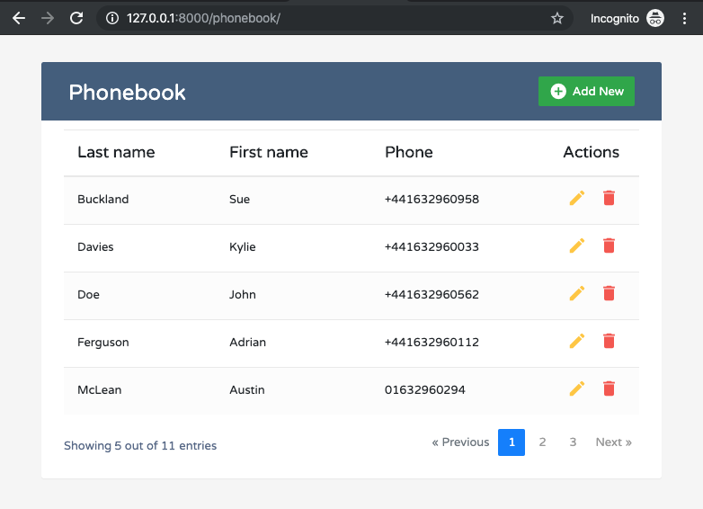

## Before setup

Before installation ensure that [composer](https://getcomposer.org/download/) and [yarn](https://yarnpkg.com/en/docs/install) packages installed on your system

## Setup process

1. Install vendors:
```
composer install
```
2. In root directory find .env file. Change **db_user** and **db_password** values to your local database accesses in **DATABASE_URL** env constant.

3. Create empty database:
```
bin/console doctrine:database:create
```
4. Run database migrations:
```
doctrine:migrations:migrate
```
5. Fill database with seeds:
```
bin/console doctrine:fixtures:load
```
6. Install front modules:
```
yarn install
```
7. Build styles and scripts:
```
yarn encore dev
```

## After setup

If all steps completed without errors now we are ready to run build-in server.
```
bin/console server:run
```

After open your browser and go to http://127.0.0.1:8000/phonebook URL.
You should see similar to this screen


